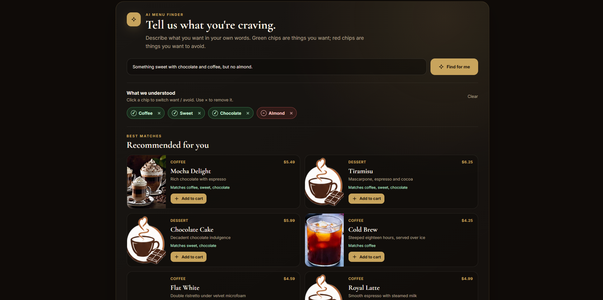

# ☕ Bihes Café — AI-Powered Coffee Shop

A full-stack coffee-shop web application with **menu browsing, authentication, cart and ordering, table reservations, admin management, and AI-assisted menu recommendations**.

The project uses a **React + Vite** frontend and a **Django REST Framework** backend. Its AI Menu Finder lets customers describe what they want in natural language, such as:

> “Something chocolate with coffee, but no almond.”

The system converts that request into editable preferences, filters the current menu, and returns the best matching items.

---

## ✨ Main Features

- ☕ Browse coffee, food, pastry, and dessert menu items
- 🔎 Search, filter, and sort the menu
- 🤖 AI-powered menu recommendation from natural-language requests
- 🟢 Editable **wanted** preferences and 🔴 **excluded** preferences
- ⚡ Instant recommendation re-ranking after preference chips are edited
- 🛒 Shopping cart and order creation
- 👤 Customer registration and JWT authentication
- 📦 Customer order history and admin order-status management
- 🪑 Table reservation system
- 🛠️ Admin menu and application management
- 📚 Swagger / OpenAPI API documentation

---

## 🤖 AI Recommendation System



### How it works

1. **Customer describes a craving**
   
   The React menu page accepts a sentence such as:

   ```text
   Something sweet with chocolate and coffee, but no almond.
   ```

2. **Frontend calls the recommendation API**

   ```http
   POST /menu/recommend/
   ```

   Example request:

   ```json
   {
     "question": "something sweet with chocolate and coffee, but no almond"
   }
   ```

3. **The backend extracts preferences**

   The recommendation service can use the optional **FLAN-T5** checkpoint to transform the request into a semantic EXR expression. The project also has a menu-aware deterministic fallback, so the endpoint still works when the AI model or its optional dependencies are unavailable.

   Example semantic output:

   ```text
   (ORDER (PIZZAORDER (COFFEE) (SWEET)(TOPPING CHOCOLATE) (NOT (TOPPING ALMOND))))
   ```
   (PIZZAORDER just telling the system what the customer wants and does not want)

4. **Preferences become editable UI chips**

   The API returns tokens such as:

   ```json
   [
     { "value": "chocolate", "state": "wanted" },
     { "value": "coffee", "state": "wanted" },
     { "value": "sweet", "state": "wanted" }
     { "value": "almond", "state": "excluded" }
   ]
   ```

   In the frontend:

   - 🟢 **Wanted** chips represent ingredients or categories the customer wants.
   - 🔴 **Excluded** chips represent ingredients or categories the customer wants to avoid.
   - Clicking a chip switches it between wanted and excluded.
   - Clicking `×` removes the preference.

5. **Available menu items are ranked**

   The recommender reads active and available menu items from the database. Items matching excluded preferences are removed. Remaining items receive a score from their matches with wanted tokens, with additional weight for direct/category matches.

6. **Best matches are returned**

   Each recommended item can include:

   ```json
   {
     "recommendation_score": 8.0,
     "matched_tokens": ["chocolate", "coffee"]
   }
   ```

7. **Editing chips does not rerun the model**

   When the customer changes the chips, the frontend sends the edited tokens back to the same endpoint:

   ```json
   {
     "tokens": [
       { "value": "chocolate", "state": "wanted", "kind": "preference" },
       { "value": "almond", "state": "excluded", "kind": "preference" }
     ]
   }
   ```

   The backend immediately re-ranks the menu using those tokens and **skips transformer inference**, making follow-up changes faster.

---

## 🧠 AI Architecture

The recommendation implementation is separated into two responsibilities:

### 1. Understanding the request

The optional trained model is loaded lazily only when the recommendation endpoint needs it.

- Model family: **FLAN-T5 / Hugging Face Transformers**
- Training data included in the AI folder: **PIZZA semantic parsing dataset**
- Output format: parenthesized **EXR / S-expression**
- Optional runtime packages: `torch`, `transformers`, and `sentencepiece`

The café integration also adds aliases such as coffee, chocolate, milk, cold, hot, pastry, dessert, and almond so the semantic preferences can be matched against café menu content.

### 2. Ranking the real menu

Menu ranking is database-aware and independent from transformer inference. This means the project can:

- recommend only currently available menu items;
- exclude items that contain unwanted terms;
- score items that match wanted preferences;
- show which preferences matched each result;
- keep working when the AI checkpoint is missing;
- re-rank edited preferences without invoking the model again.

---

## 🛠️ Technology Stack

### Frontend

- React 19
- React Router
- Vite 8
- JavaScript / JSX
- CSS
- Fetch-based API client

### Backend

- Python 3.12+
- Django 6
- Django REST Framework
- Simple JWT authentication
- django-filter
- drf-spectacular / Swagger
- SQLite by default
- PostgreSQL supported through `psycopg`

### AI

- FLAN-T5 checkpoint
- Hugging Face Transformers
- PyTorch
- SentencePiece
- Custom EXR / S-expression parser
- Deterministic menu-matching fallback

---

## 📁 Project Structure

```text
project/
├── bihes-back/
│   ├── apps/
│   │   ├── accounts/                 # users, login, registration, roles
│   │   ├── menu/
│   │   │   ├── ai_recommendation.py  # AI parsing + fallback + ranking
│   │   │   ├── recommendation_views.py
│   │   │   ├── recommendation_serializers.py
│   │   │   ├── models.py
│   │   │   └── urls.py
│   │   ├── orders/                   # order workflow
│   │   └── reservations/             # table reservations
│   ├── core/                         # Django settings, API errors, Swagger
│   ├── pizza_ai/
│   │   ├── checkpoints/              # trained model goes here
│   │   ├── source/                   # training / inference scripts + data
│   │   └── tree_reference/           # semantic-tree utilities
│   ├── requirements.txt
│   ├── requirements-ai.txt
│   └── manage.py
│
└── bihes-front/
    └── bihes-front/
        ├── src/
        │   ├── api/                  # backend API functions
        │   ├── auth/                 # authentication context
        │   ├── cart/                 # cart state
        │   ├── components/
        │   └── pages/
        │       ├── Home.jsx
        │       ├── MenuPage.jsx      # AI Menu Finder UI
        │       ├── Orders.jsx
        │       ├── Reservations.jsx
        │       └── Admin.jsx
        ├── package.json
        └── vite.config.js
```

---

## 🚀 Running the Project Locally

### 1. Backend setup

Open a terminal in `bihes-back`:

```bash
cd bihes-back
python3 -m venv venv
```

Activate the virtual environment if desired, then install the backend packages:

```bash
./venv/bin/pip install -r requirements.txt
```

On Windows:

```powershell
venv\Scripts\pip install -r requirements.txt
```

Create local settings from the provided example:

```bash
cp local_settings.example.py local_settings.py
```

Generate a Django secret key and place it in `local_settings.py`:

```bash
./venv/bin/python -c "from django.core.management.utils import get_random_secret_key; print(get_random_secret_key())"
```

Apply migrations:

```bash
./venv/bin/python manage.py migrate
```

Optional demo users and reservation tables can be created with:

```bash
./venv/bin/python manage.py seed_demo
```

Run the backend:

```bash
./venv/bin/python manage.py runserver
```

Backend URL:

```text
http://127.0.0.1:8000/
```

The site root opens the Swagger UI.

---

### 2. Frontend setup

Open another terminal in the React app directory:

```bash
cd bihes-front/bihes-front
npm install
npm run dev
```

Frontend URL:

```text
http://localhost:5173/
```

During development, Vite proxies API requests to the Django backend.

---

## 🤖 Enabling the Trained AI Model

The recommendation endpoint works without the model, but to use transformer inference you need the trained checkpoint.

Place the checkpoint files inside:

```text
bihes-back/pizza_ai/checkpoints/flan_t5_pizza/
```

A typical Hugging Face checkpoint contains files such as:

```text
config.json
model.safetensors        # or another model-weight file
tokenizer_config.json
special_tokens_map.json
spiece.model             # depending on tokenizer
```

Install the optional AI packages:

```bash
pip install -r requirements-ai.txt
```

You can also store the model elsewhere and provide an absolute path:

```bash
export PIZZA_MODEL_PATH=/absolute/path/to/flan_t5_pizza
```

If no valid checkpoint is found, the API reports:

```json
{
  "model": {
    "status": "checkpoint_missing",
    "used": false,
    "expression": null
  }
}
```

The recommendation fallback will still run.

---

## 🔌 Important API Endpoints

| Method | Endpoint | Purpose |
|---|---|---|
| `POST` | `/accounts/auth/register/` | Register a customer |
| `POST` | `/accounts/auth/login/` | Get JWT tokens |
| `GET` | `/accounts/auth/me/` | Get current user |
| `GET` | `/menu/categories/` | List menu categories |
| `GET` | `/menu/menu-items/` | List menu items |
| `POST` | `/menu/recommend/` | Get AI menu recommendations |
| `GET/POST` | `/orders/orders/` | View or create orders |
| `GET/POST` | `/reservations/...` | Reservation endpoints |
| `GET` | `/` | Swagger UI |
| `GET` | `/admin/` | Django admin |

---

## 📡 Recommendation API Example

### Request

```bash
curl -X POST http://127.0.0.1:8000/menu/recommend/ \
  -H "Content-Type: application/json" \
  -d '{"question":"something chocolate with coffee but no almond"}'
```

### Example response shape

```json
{
  "tokens": [
    {
      "value": "chocolate",
      "label": "Chocolate",
      "kind": "preference",
      "state": "wanted",
      "source": "menu"
    },
    {
      "value": "almond",
      "label": "Almond",
      "kind": "preference",
      "state": "excluded",
      "source": "menu"
    }
  ],
  "items": [
    {
      "id": 1,
      "name": "Mocha Delight",
      "recommendation_score": 4.0,
      "matched_tokens": ["chocolate"]
    }
  ],
  "model": {
    "status": "ready",
    "used": true,
    "expression": "..."
  }
}
```

> The exact menu items and scores depend on the current database and detected tokens.

---

## 🧪 Tests

Run the backend test suite with:

```bash
./venv/bin/python manage.py test
```

Recommendation tests cover important behavior such as:

- converting a free-text question into editable tokens;
- excluding menu items that match an unwanted preference;
- returning ranked menu matches;
- re-ranking edited tokens without calling the model again.

---

## 🔐 Authentication and Roles

The API uses JWT authentication.

Two application roles are used:

- `customer` — browses the menu, creates orders/reservations, and manages their own data;
- `admin` — manages menu data and administrative workflows.

Public menu reads and the AI recommendation endpoint do not require authentication.

---

## 💡 Why the AI Design Is Useful

The AI feature is intentionally built as a **hybrid recommendation system** rather than making the transformer responsible for everything.

The model focuses on understanding natural language, while normal application code performs filtering and ranking against the real database. This makes the feature easier to test, faster to update after users edit preferences, and more reliable when the optional AI checkpoint is unavailable.

---

## 🔮 Possible Future Improvements

- Train or fine-tune the semantic parser directly on coffee-shop requests
- Add dietary preferences such as vegan, lactose-free, gluten-free, or nut-free
- Add semantic embeddings for descriptions and ingredients
- Learn from previous orders and customer feedback
- Add recommendation explanations such as “recommended because you asked for chocolate and coffee”
- Add configurable recommendation weights through the admin panel
- Add Docker and production deployment configuration
- Add frontend tests for the AI Menu Finder


